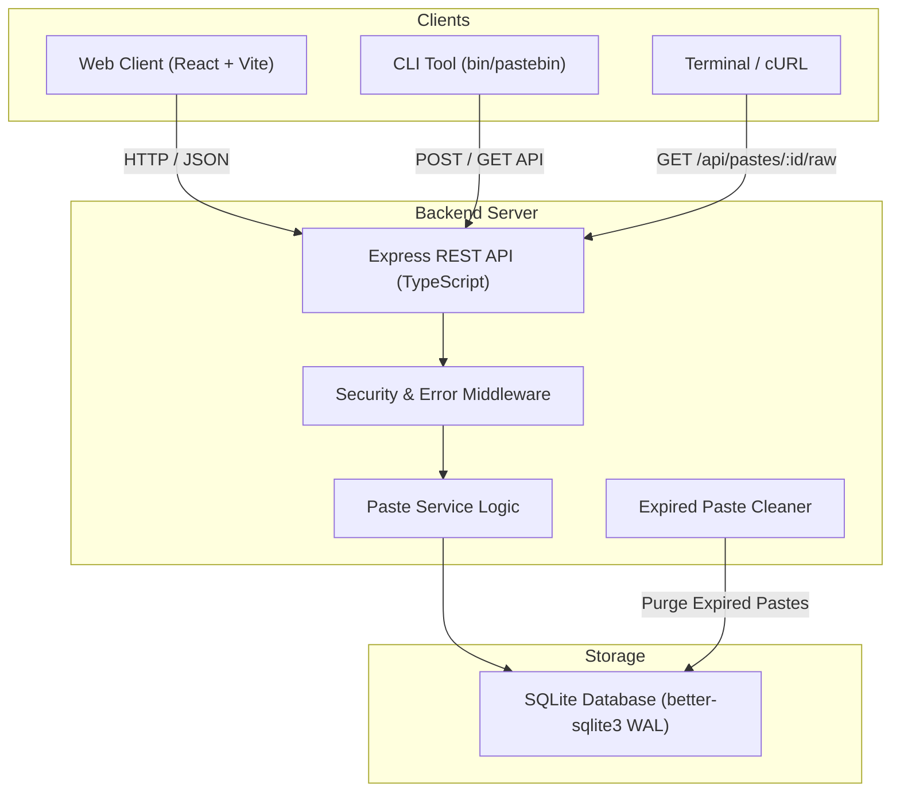

# PasteBin - Code & Text Sharing Platform

A lightweight snippet sharing platform built with **Express (TypeScript)**, **React (Vite)**, and **SQLite**.

---

## Features

- **Code & Text Snippet Creation**: Supports custom titles, custom URL slugs (`--custom`), and syntax highlighting for Plain Text, JavaScript, Python, Java, C/C++, HTML, and SQL.
- **Security & Privacy**:
  - **Burn After Reading**: Self-destruct snippet after 1 view.
  - **Password Protection**: Encrypt paste access using bcrypt.
  - **Unlisted Pastes**: Hide pastes from the public Explore list.
  - **Secret Deletion Token**: Delete your paste anytime using a secret token.
- **Expiration Timers**: Automatically expire pastes (10m, 1h, 1d, 1w, 1m, or never).
- **Dual Clients**:
  1. **Web App**: Clean white and emerald user interface.
  2. **CLI Client (`bin/pastebin`)**: Pipe text straight from your shell (`cat file.js | ./bin/pastebin`).
- **Containerized**: Includes `Dockerfile` and `docker-compose.yml`.

---

## Architecture Diagram



---

## Quickstart Guide

### Option 1: Local Development

```bash
# 1. Install dependencies
npm run install:all

# 2. Start dev server
npm run dev
```
Open **http://localhost:4000** in your browser.

---

### Option 2: Docker Compose

```bash
docker-compose up -d --build
```
Open **http://localhost:4000** in your browser.

---

## CLI Client Usage

The project includes a terminal CLI executable script at `bin/pastebin`.

```bash
# Make executable
chmod +x bin/pastebin

# 1. Pipe file contents directly to PasteBin
cat server/src/index.ts | ./bin/pastebin --title "Server Entry" --lang javascript --ttl 1d

# 2. Upload a specific file with a custom slug
./bin/pastebin --file README.md --custom my-readme --burn

# 3. Retrieve raw text snippet in terminal
./bin/pastebin get a7x9q2
```

---

## API Reference Overview

Detailed documentation is available in the in-app **API Docs** tab.

| Method | Endpoint | Description |
| :--- | :--- | :--- |
| `POST` | `/api/pastes` | Create a snippet |
| `GET` | `/api/pastes` | List public snippets |
| `GET` | `/api/pastes/:id` | Fetch paste details and content |
| `DELETE` | `/api/pastes/:id` | Delete paste using token |


---

## Testing & Build

Run backend integration tests:
```bash
npm test
```

Build project:
```bash
npm run build
```
